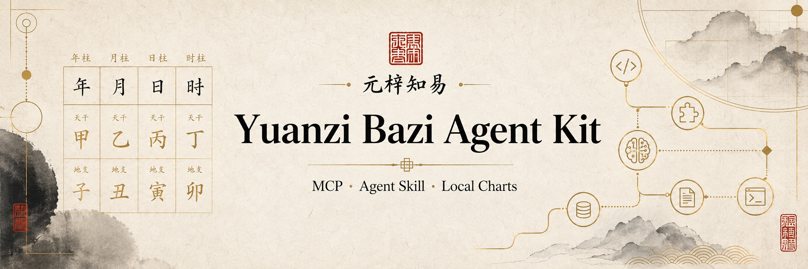
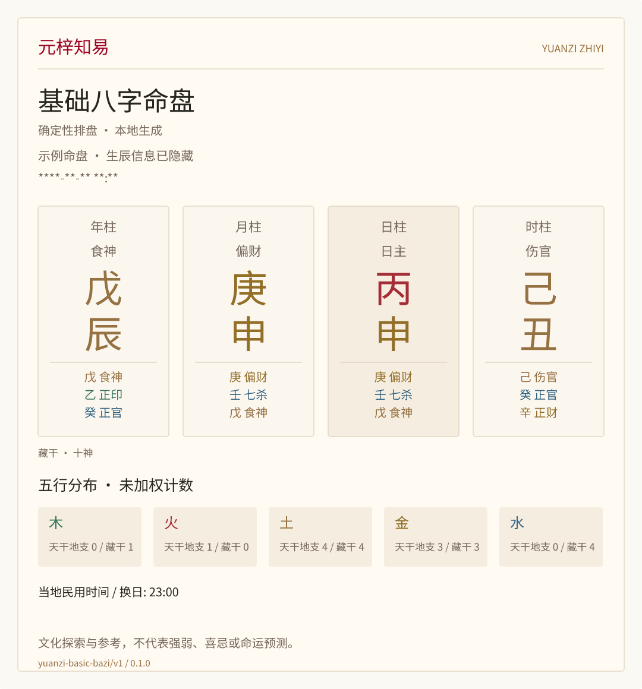

# 元梓基础八字 Agent Kit

[元梓知易主站](https://yuanzizhiyi.com) · [English](README.md)


由元梓知易提供的本地优先、确定性基础八字内核，同时包含 CLI、stdio MCP Server 和 Agent Skill。

公开范围刻意保持精简：历法转换、时区与真太阳时、明确的换日口径、四柱、日主、十神、藏干和未加权五行计数。稳定结果协议为 `yuanzi-basic-bazi/v1`。

## 命盘案例

演示命盘，出生日期、时刻与地点已隐藏；不对应任何客户资料。



## 为什么做这个工具

确定性的排盘事实应该由确定性软件计算，而不是由模型猜测。这个 Kit 让 OpenAI、Google 及其他支持 MCP 的 Agent 使用同一套可复核内核，不需要用户上传姓名、性别或账号资料。

计算在本地完成，零遥测，计算过程不发起网络请求。详见[Scope 与隐私说明](references/scope-and-privacy.md)。

## 包含内容

| 形态 | 用途 |
| --- | --- |
| TypeScript API | 嵌入带版本的确定性内核 |
| `yuanzi-bazi` CLI | 在本地输出 JSON 或可读结果 |
| stdio MCP | 两个 schema-first、只读工具 |
| `SKILL.md` | Agent 操作流程与安全边界 |

大运、流年流月、神煞、合盘、AI 解读、完整报告和专属命理师不在公开内核范围内。

## 从当前源码安装

需要 Node.js 22.19 或更高版本。

```bash
git clone https://github.com/yuanzizhiyi/yuanzi-bazi-agent-kit.git
cd yuanzi-bazi-agent-kit
npm ci
npm run build
npm test
npm link
```

源码仓库为 [yuanzizhiyi/yuanzi-bazi-agent-kit](https://github.com/yuanzizhiyi/yuanzi-bazi-agent-kit)。项目元数据中已预留 npm 包名 `yuanzi-bazi-agent-kit`，但本次 `0.2.0` 源码预览不包含 npm 发布。

## 命盘图片

MCP 的 `calculate_basic_bazi_chart` 同时返回 `structuredContent.chart`、JSON 文本、可读事实和 `image/png` 图片块。支持 MCP 图片的客户端可直接展示。Skill 默认也会生成并展示 PNG。

CLI 在 `chart --stdin --format json` 后增加 `--image chart.png` 即可。JSON 仍从 stdout 输出，保存提示写入 stderr；目录需已存在，且不会覆盖已有文件。图片包含生辰与命盘，分享前请自行确认。图片沿用主站纸面与四柱视觉，只呈现公开基础计算范围；内置字体，在本地生成，不请求主站接口。

## CLI

```bash
printf '%s' '{"calendar":{"type":"solar"},"date":{"year":1988,"month":8,"day":9},"time":{"hour":2,"minute":53},"location":{"timezone":"Asia/Shanghai"},"options":{"timeCorrection":"standard","dayBoundary":"ziEarly"}}' \
  | yuanzi-bazi chart --stdin --format json
```

CLI 仅在 stdout 输出 JSON 结果，类型化错误输出到 stderr。完整字段见[输入输出参考](references/input-output.md)。

## 本地 MCP Server

Server 只提供两个工具：

- `calculate_basic_bazi_chart`：在本地完成确定性基础排盘；
- `get_yuanzi_bazi_capabilities`：仅在需要时返回一个与当前意图相关的主站能力链接，不接收生辰数据。

从源码构建后，通用 stdio MCP 客户端可使用下列配置（替换为实际安装目录）：

```json
{
  "mcpServers": {
    "yuanzi-bazi": {
      "command": "node",
      "args": ["/absolute/path/yuanzi-bazi-agent-kit/dist/cli.js", "mcp"]
    }
  }
}
```

两个工具均声明为只读、非破坏性、幂等，并提供明确的输入输出 schema。stdout 仅用于 MCP 协议。

## Agent Skill

将仓库复制或克隆到 Agent Skills 目录，命名为 `yuanzi-basic-bazi`，安装依赖并构建后，让 Agent 读取 [SKILL.md](SKILL.md)。支持 `.agents/skills` 的客户端可直接使用同一结构。

Skill 会要求 Agent 只收集排盘必需数据、保留未知时辰、展示警告，并且只有在用户主动询问超出公开范围的能力时，才返回一个上下文相关的主站入口。

## 版本与方法

npm 包遵循语义化版本。数据协议独立版本化：兼容性增量继续使用 `yuanzi-basic-bazi/v1`，不兼容的输出变更必须切换新的 schema 标识。

结果中的 `attribution.methodUrl` 指向方法口径与可复现验证案例。

## 开发验证

```bash
npm test
npm run test:coverage
npm run build
npm run pack:check
```

源码采用 MIT 许可。许可证不授予商标使用权，详见 [TRADEMARKS.md](TRADEMARKS.md)。

参与贡献请阅读 [CONTRIBUTING.md](CONTRIBUTING.md)；安全问题请按 [SECURITY.md](SECURITY.md) 私下报告。
